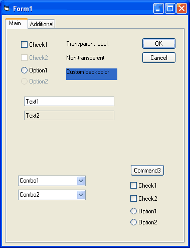



## UPDATE\(2006\.06\.26\): Theming tabstrip panes and contained controls

### Description

UPDATE(2006.06.26): Multi-threading issues solved. Now various OS dialogs don't crash app (common dialogs, browse for folder, browse for printers, etc.). Need Compact In-Process Multi-threading: A FolderWatcher with sample UI (http://www.pscode.com/vb/scripts/ShowCode.asp?txtCodeId=36373&amp;lngWId=1) registered to load sample Project2.

----

UPDATE(2006.02.08): Now supports Uniscribe Unicode script processor for complex script and right-to-left languages. Couple of bugfixes and performance optimizations.

----

UPDATE(2005.12.09): Now vbButtonFace colored backgrounds of Edits/TextBoxes are painted "transparent" -- for emulating selectable labels with locked borderless textboxes. More API hooking involved :-))

----

REUPLOAD(2005.12.03): This is a sample project that shows how to paint tabstrip panes using current theme background (see screenshot). Also, contained controls background is taken care of (CheckBox, OptionButton, CommandButton). uxtheme exports EnableThemeDialogTexture function which unfortunately is not working with VB6 containers (PictureBox, Frame, etc.) Also, there is a problem with windowless controls in its implementation -- these paint directly on the container DC. The presented solution subclasses the container and responds to WM_CTLCOLORBTN and WM_CTLCOLORSTATIC notifications by painting contained control background using current theme and returning NULL_BRUSH. This resolves contained controls requests for integration with parent background. For the container background FillRect API is hooked just before forwarding WM_PAINT and requests for vbButtonFace solid brush are replaced with themed background -- pretty cool and working!! Enjoy and don't forget to vote!
 
### More Info
 

             |
---                |---
**Submitted On**   |2006-02-08 13:45:46
**By**             |[Vlad Vissoultchev](https://github.com/Planet-Source-Code/PSCIndex/blob/master/ByAuthor/vlad-vissoultchev.md)
**Level**          |Intermediate
**User Rating**    |5.0 (119 globes from 24 users)
**Compatibility**  |VB 6\.0
**Category**       |[Libraries](https://github.com/Planet-Source-Code/PSCIndex/blob/master/ByCategory/libraries__1-49.md)
**World**          |[Visual Basic](https://github.com/Planet-Source-Code/PSCIndex/blob/master/ByWorld/visual-basic.md)
**Archive File**   |[UPDATE\(2002002796262006\.zip](https://github.com/Planet-Source-Code/vlad-vissoultchev-update-2006-06-26-theming-tabstrip-panes-and-contained-controls__1-63469/archive/master.zip)

